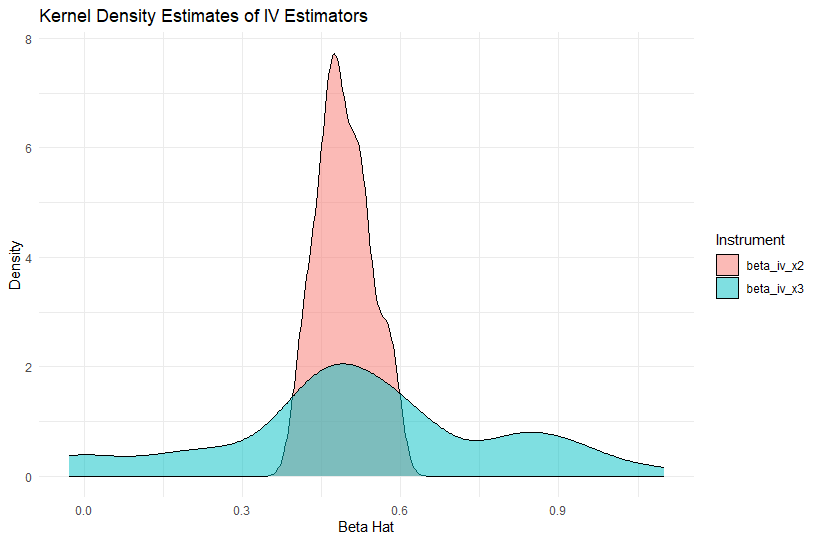

\begin{flushright}
Michael Manolakis \\
Econ 629 Econometrics 2 - CRN 79650 \\
Problem Set 5 \\
9 December 2025
\end{flushright}

\bigskip


Consider the following data generating process (DGP):
$$
y = 1 + 0.5x + v
$$
where $x \sim N(1,1)$ and $v \sim N(0,1)$. Cannot observe $x$ but instead observes one (or two) of the following:

$$
\begin{aligned}
x^*_1 &= x + e_1 \quad \text{where } e_1 \sim N(0, 0.25) \\
x^*_2 &= x + e_2 \quad \text{where } e_2 \sim N(0, 0.5) \\
x^*_3 &= x + e_3 \quad \text{where } e_3 \sim N(0, 19).
\end{aligned}
$$
1. Simulate this DGP for N = 500 a total of 50 times.

    a. 
    # Defining Parameters
    n_sims <- 50
    n <- 500
    
    # Container for Results
    sim_results <- tibble(iteration = 1:n_sims, beta_hat_ols1 = NA_real_, 
                          beta_hat_iv = NA_real_)
    
    for (i in 1:n_sims) {
      
      # --- A. Data Generating Process ---
      x <- rnorm(n = n, mean = 1, sd = 1)
      v <- rnorm(n = n, mean = 0, sd = 1)
      y <- 1 + 0.5 * x + v
      
      e1 <- rnorm(n = n, mean = 0, sd = sqrt(0.25))
      e2 <- rnorm(n = n, mean = 0, sd = sqrt(0.5))
      e3 <- rnorm(n = n, mean = 0, sd = sqrt(19))
      
      x1 <- x + e1
      x2 <- x + e2
      x3 <- x + e3
      
      # Create a temporary dataframe for this iteration
      df_iter <- tibble(y, x1, x2, x3)
    }

2. What are the theoretical biases from a regression of y onto $x^*_1$, $x^*_2$, and $x^*_3$?

    a.
    1. Perform OLS regression
    ols_model1 <- lm(y ~ x1, data = df_iter)

    2. Extract the coefficient for x^*_1
    beta_x1 <- coef(ols_model1)[["x1"]]
    
    3. Save to the i-th row of the results tibble
    sim_results$beta_hat_ols[i] <- beta_x1
    
    Rinse repeat
    ols_model2 <- lm(y ~ x2, data = df_iter)
    beta_x2 <- coef(ols_model)[["x2"]]
    sim_results$beta_hat_ols[i] <- beta_x2
    
    ols_model3 <- lm(y ~ x3, data = df_iter)
    beta_x3 <- coef(ols_model)[["x3"]]
    sim_results$beta_hat_ols[i] <- beta_x3

\bigskip

3. How do the empirical biases compare to the theoretical biases?

    a. It was a many step process, first we would need to recreate question 1 too then account for beta_hat_x3 and beta_hat_x2. From here we then would add in the information gathered from within the for loop in question 2 after the generation of the temporary dataframe. To be more specific on what was added after the for loop, I put in the ols_model1/2/3 along with the related sim_results for the beta_hat.F After the for loop I took the average for fun and resolve question 3. By this I mean that using the LLN from Ch.3 of Wooldridge and Amemiya, we can use this to average to approximate a probability limit.

\bigskip

4. Consider two IV regressions of y onto $x^*_1$. The first uses $x^*_2$, and the second uses $x^*_3$ as the instrumental variable. What is the mean of both IV estimates?

    a. 
    Estimate IV regression (y on x^*_1, instrumented by x^*_2)
    iv_model <- ivreg(y ~ x1 | x2, data = df_iter)
    
    Extract the coefficient for x1
    beta_iv_x1 <- coef(iv_model)[["x1"]]
    
    Saving Results
    sim_results$beta_hat_iv[i] <- beta_iv_x1

5. What are the average first stage F-statistics from both sets of regressions?

    a. 
    Summary object creation w/ diagnostics enabled
    This calculates the Weak Instruments test (First-stage F-stat)
    iv_summary <- summary(iv_model, diagnostics = TRUE)
    
    Extract F Stats
    Storing it in the 'diagnostics' matrix under the row "Weak instruments" and column "statistic"
    f_stat <- iv_summary$diagnostics["Weak instruments", "statistic"]
    
\newpage

6. Using the twoway command, plot kernel density estimates of both simulated IV estimates in a single plot.

    a. 
    Summary object creation w/ diagnostics enabled
    This calculates the Weak Instruments test (First-stage F-stat)
    iv_summary <- summary(iv_model, diagnostics = TRUE)

7. What can we conclude about the IV estimates that use $x^*_3$ as the instrument? Why does it matter?

    a. 
    #sim_results %>%
    select(beta_iv_x2, beta_iv_x3) %>%
    pivot_longer(cols = everything(), names_to = "Instrument", values_to = "Estimate") %>%
    ggplot(aes(x = Estimate, fill = Instrument)) +
    geom_density(alpha = 0.5) +
    labs(
      title = "Kernel Density Estimates of IV Estimators",
      x = "Beta Hat",
      y = "Density"
    ) + theme_minimal()
    
\bigskip

8. Sample Graph : 
```{r, echo=FALSE, out.width="90%", fig.align='center'}

```

